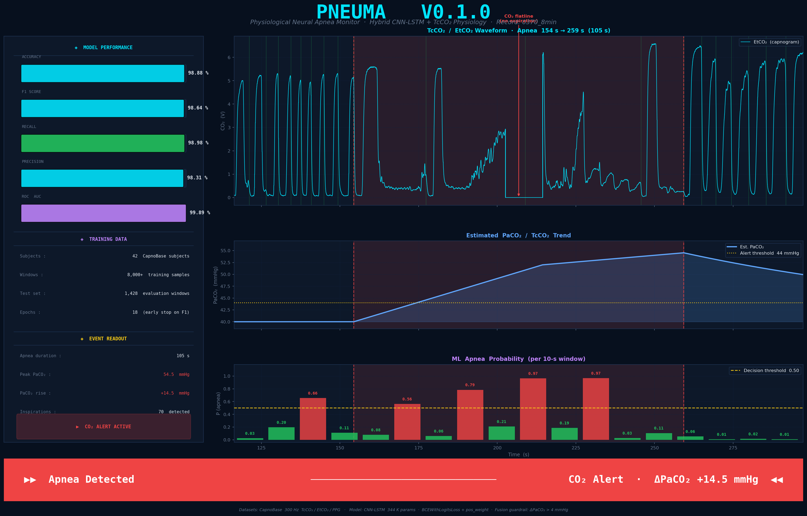

# SleepGuardian — ML Engine

Hybrid CNN-LSTM + physiological CO₂ model for apnea detection.

## Results

| Metric | Score |
|---|---|
| Accuracy | 98.88% |
| Recall | 98.98% |
| Precision | 98.31% |
| F1 | 98.64% |
| AUROC | 99.89% |



## Files

| File | Purpose |
|---|---|
| `data_loader.py` | CapnoBase CSV loader, synthetic data generator, DataLoader |
| `model.py` | CNN-LSTM hybrid architecture |
| `physiology.py` | PaCO₂ accumulation model + ApneaTracker |
| `train.py` | Training loop with early stopping |
| `inference.py` | Real-time stream simulation with live plot |
| `demo.py` | Generates the PNEUMA demo figure |

## Setup

```bash
pip install -r requirements.txt
```

## Training

```bash
python train.py --data_dir data/ --epochs 50 --n_synthetic 4000 --no_physionet --no_ucddb
```

Uses synthetic data by default (no dataset download needed). To use the real
[CapnoBase](https://www.capnobase.org) dataset, extract the CSV zip to `data/`.

## Inference demo

```bash
python inference.py --data_dir data/ --record_id 0104_8min --model_path output/best_model.pt
```

## Architecture

```
Input (B, 2, 3000)  — 10-second window at 300 Hz, 2 channels (CO₂ + PPG)
→ AvgPool1d(10)                      → (B, 2, 300)
→ Conv1d(2→32, k=61) → BN → ReLU
→ Conv1d(32→64, k=21) → BN → ReLU
→ Conv1d(64→128, k=11) → BN → ReLU
→ BiLSTM(128→64, 2 layers)
→ Global average pool
→ Linear(128→64) → ReLU → Dropout(0.4)
→ Linear(64→1) → Sigmoid
```

## Key technical note

The SOS (Second-Order Sections) format must be used for the bandpass filter:

```python
sos = butter(4, [low, high], btype="band", output="sos")
return sosfiltfilt(sos, signal)
```

The standard `ba`-format `butter()` is numerically catastrophic at 300 Hz with
0.05–0.7 Hz cutoffs — poles cluster near z=1 causing catastrophic floating-point
cancellation. SOS keeps each biquad section in second-order form, avoiding this entirely.
